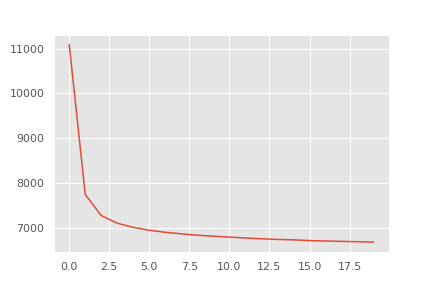
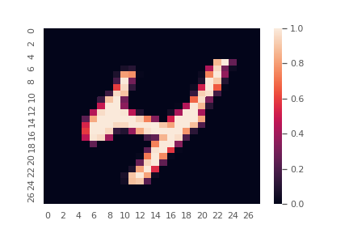
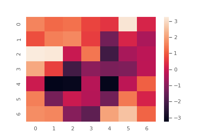
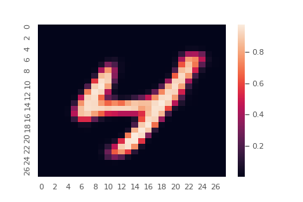
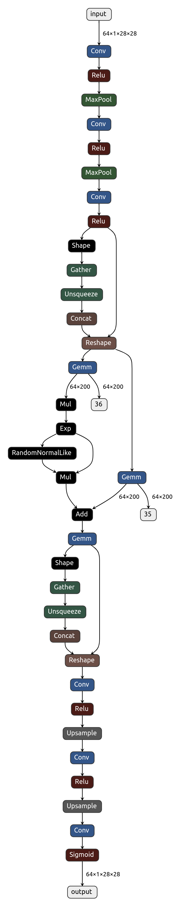

## Convolutional VAE

### 概要

畳み込み変分オートエンコーダをpytorchを用いて実装した.

モデルテストには, mnistデータを使用.

参考文献）[Auto-Encoding Variational Bayes](https://arxiv.org/abs/1312.6114)

### 実装内容

- `/notebooks/ConvVAE.ipynb`
- `/src/functions`
- `/src/models`

### 結果

Loss

入力画像

エンコード後の入力画像（潜在変数）

出力画像

ネットワーク図

